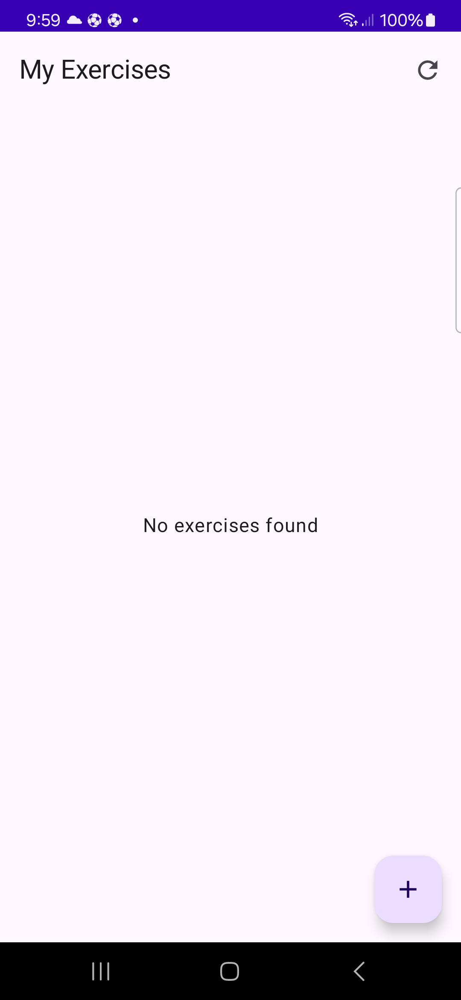
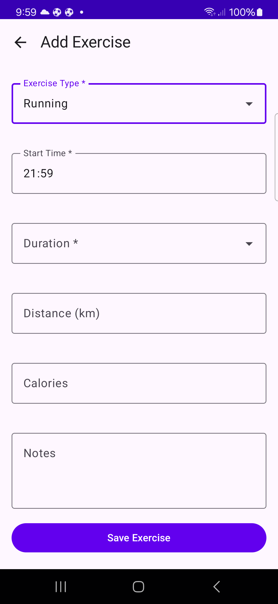
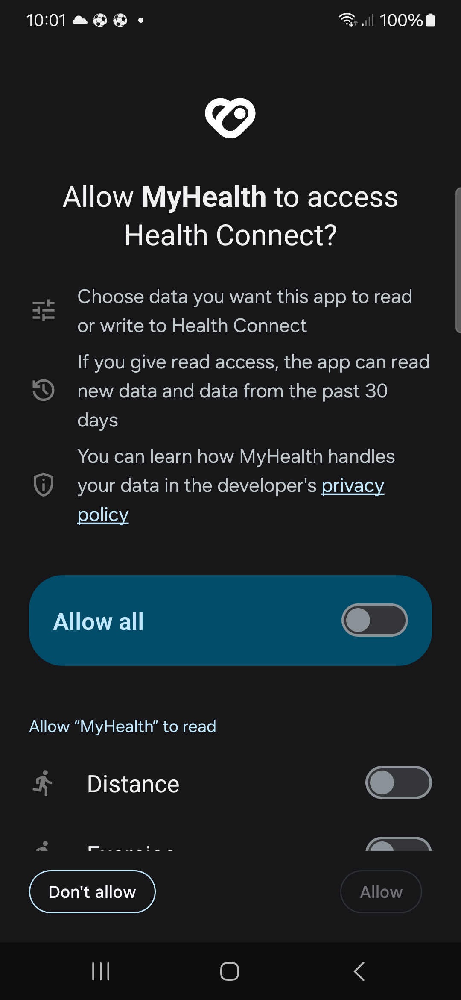
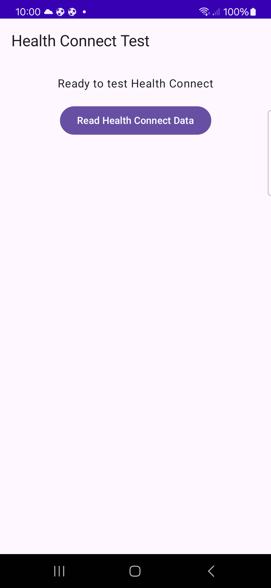

# MyHealthApp - Exercise Tracking Application

An Android application for exercise tracking integrated with Health Connect. Supports manual exercise input and Health Connect synchronization with time conflict detection and resolution.

## Key Features

### 1. Exercise Record Management
- **Manual Input**: Enter exercise type, start time, duration, distance, calories, and notes
- **Automatic Sync**: Fetch last 7 days of exercise data from Health Connect
- **Persistent Storage**: Local storage via Room database
- **Real-time Updates**: Automatic UI updates using Flow

### 2. Health Connect Integration
- Read exercise data through Health Connect API
- Permission management with automatic permission requests
- Duplicate data removal (Health Connect data takes priority)

### 3. Conflict Detection and Resolution
- Automatic detection of time-overlapping exercises
- Separate conflict groups with sequential resolution
- User-driven conflict resolution

## Tech Stack

- **Language**: Kotlin 2.1.0
- **UI**: Jetpack Compose + Material3
- **Architecture**: MVVM + Repository Pattern
- **Database**: Room 2.6.1
- **Async**: Kotlin Coroutines + Flow
- **Health**: Health Connect Client 1.1.0-rc03
- **Date/Time**: kotlinx-datetime 0.7.1

## Project Structure

```
app/src/main/java/com/assessemnt/myhealthapp/
├── data/
│   ├── healthconnect/
│   │   └── HealthConnectManager.kt        # Health Connect API integration
│   ├── local/
│   │   ├── ExerciseEntity.kt              # Room entity
│   │   ├── ExerciseDao.kt                 # Data access object
│   │   └── ExerciseDatabase.kt            # Room database
│   └── repository/
│       └── ExerciseRepository.kt          # Data repository
├── domain/
│   └── model/
│       ├── Exercise.kt                    # Exercise domain model
│       ├── DataSource.kt                  # Data source (Manual/HealthConnect)
│       └── ExerciseConflict.kt            # Conflict model
└── presentation/
    ├── exerciselist/
    │   ├── ExerciseListScreen.kt          # Exercise list screen
    │   └── ExerciseListViewModel.kt       # Exercise list logic
    ├── manualinput/
    │   ├── ManualInputScreen.kt           # Manual input screen
    │   └── ManualInputViewModel.kt        # Manual input logic
    └── navigation/
        └── NavGraph.kt                    # Screen navigation
```

## Conflict Detection and Resolution

### Conflict Scenarios

A conflict occurs when exercise records **overlap in time**. Overlap is determined by start time and duration, regardless of exercise type.

#### Example 1: Simple Overlap
```
Exercise A: Running, 10:00-10:30 (30 min)
Exercise B: Walking, 10:15-10:45 (30 min)
→ Conflict detected (overlap in 10:15-10:30 window)
```

#### Example 2: Complete Containment
```
Exercise A: Running, 10:00-11:00 (60 min)
Exercise B: Yoga, 10:20-10:40 (20 min)
→ Conflict detected (Exercise B is completely contained in Exercise A)
```

#### Example 3: Sequential Exercises (No Conflict)
```
Exercise A: Running, 10:00-10:30 (30 min)
Exercise B: Walking, 10:30-11:00 (30 min)
→ No conflict (start/end times exactly touch)
```

### Conflict Group Separation

When multiple exercises exist, only connected conflicts are grouped together.

#### Example: 2 Independent Conflict Groups
```
Group 1 (3 PM timeframe):
  - Walking 15 min, starts at 15:25
  - Walking 15 min, starts at 15:15
  → Overlap in 15:15-15:40 window

Group 2 (12 PM timeframe):
  - Walking 25 min, starts at 12:25
  - Walking 25 min, starts at 12:15
  → Overlap in 12:15-12:50 window

Result: 2 separate conflict popups displayed sequentially
```

### Conflict Resolution Process

1. **Conflict Detection**
   - When returning to ExerciseListScreen after manual input
   - When clicking Health Connect sync button
   - Checks all exercises in database

2. **Group Separation**
   - Find connected conflicts using graph algorithm
   - Process each group independently

3. **Popup Display**
   - Display first conflict group
   - Select exercise to keep with radio buttons
   - Choose "Keep Selected" or "Cancel"

4. **Resolution Handling**
   - **Keep Selected**: Keep selected exercise, delete others
   - **Cancel**: Keep all exercises (cancel resolution)

5. **Next Group Processing**
   - Automatically check for next conflict group after resolution
   - Display popup if more groups exist
   - Repeat until all conflicts resolved

## Health Connect Integration

### Permission Request
The app requests the following Health Connect permission:
- `READ_EXERCISE` (ExerciseSessionRecord): Read exercise records

### Synchronization Flow

1. **Manual Sync**
   - Click refresh button in ExerciseListScreen
   - Check Health Connect availability
   - Navigate to PermissionCheckActivity if no permission

2. **Data Fetching**
   - Query ExerciseSessionRecord for last 7 days
   - Convert to Exercise domain model
   - Mark as DataSource.HEALTH_CONNECT

3. **Duplicate Removal**
   - Same exercise type + within 5 minutes → considered duplicate
   - Health Connect data takes priority over Manual data
   - Keep only unique exercises after deduplication

4. **Database Storage**
   - Save all unique exercises to Room database
   - Update if same ID exists (REPLACE strategy)

5. **Conflict Check**
   - Check for conflicts in complete exercise list after saving
   - Prompt resolution via popup if conflicts found

### Health Connect Data Format

```kotlin
// Exercise fetched from Health Connect
Exercise(
    id = "hc_123456",                    // Health Connect unique ID
    type = "Running",                     // Exercise type
    startTime = LocalDateTime(...),       // Start time
    durationMinutes = 30,                 // Duration
    source = DataSource.HEALTH_CONNECT,   // Source indicator
    distance = 5.2,                       // Distance (km)
    calories = 320,                       // Calories
    notes = null                          // Health Connect has no notes
)
```

## Screenshots

### Main Exercise List
The main screen showing all tracked exercises with manual and Health Connect synced data.



### Manual Exercise Input
Add exercises manually with type, time, duration, distance, calories, and notes.



### Health Connect Permission
Permission request screen when Health Connect access is needed.



### Health Connect Integration
Screen shown when the app doesn't have Health Connect permission.



## Usage

### 1. Add Manual Exercise
1. Click '+' button at bottom-right of screen
2. Enter exercise type, start time, duration (required)
3. Enter distance, calories, notes (optional)
4. Click "Save Exercise" button
5. Conflict check automatically runs when returning to list screen

### 2. Health Connect Sync
1. Click refresh button at top-right of screen
2. Approve permission in Health Connect app when requested
3. Automatically fetch last 7 days of data
4. Duplicate removal and conflict check run automatically

### 3. Resolve Conflicts
1. Select exercise to keep in conflict popup (radio button)
2. Click "Keep Selected" to keep only selected exercise
3. Or click "Cancel" to keep all exercises
4. Next conflict group automatically displays if exists

### 4. Delete Exercise
1. Long press on exercise card
2. Click "Delete" in confirmation dialog

## Known Limitations

1. **Sync Range**: Health Connect sync limited to last 7 days
2. **Duplicate Detection**: Only same exercise type within 5 minutes considered duplicate
3. **Offline**: Health Connect sync doesn't require internet (local API)
4. **Data Loss**: Health Connect data overwrites Manual data
