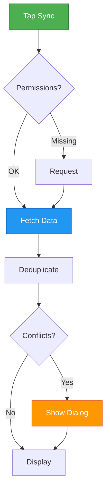
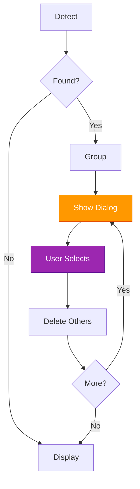
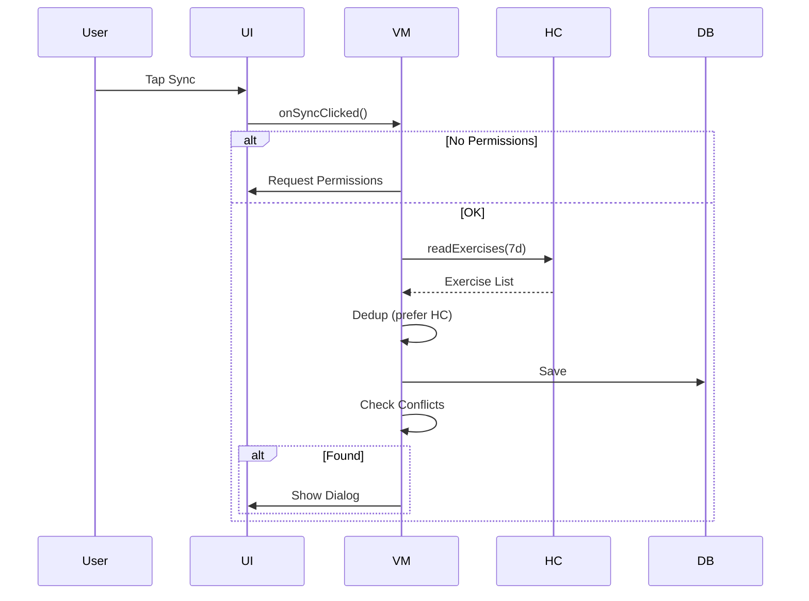
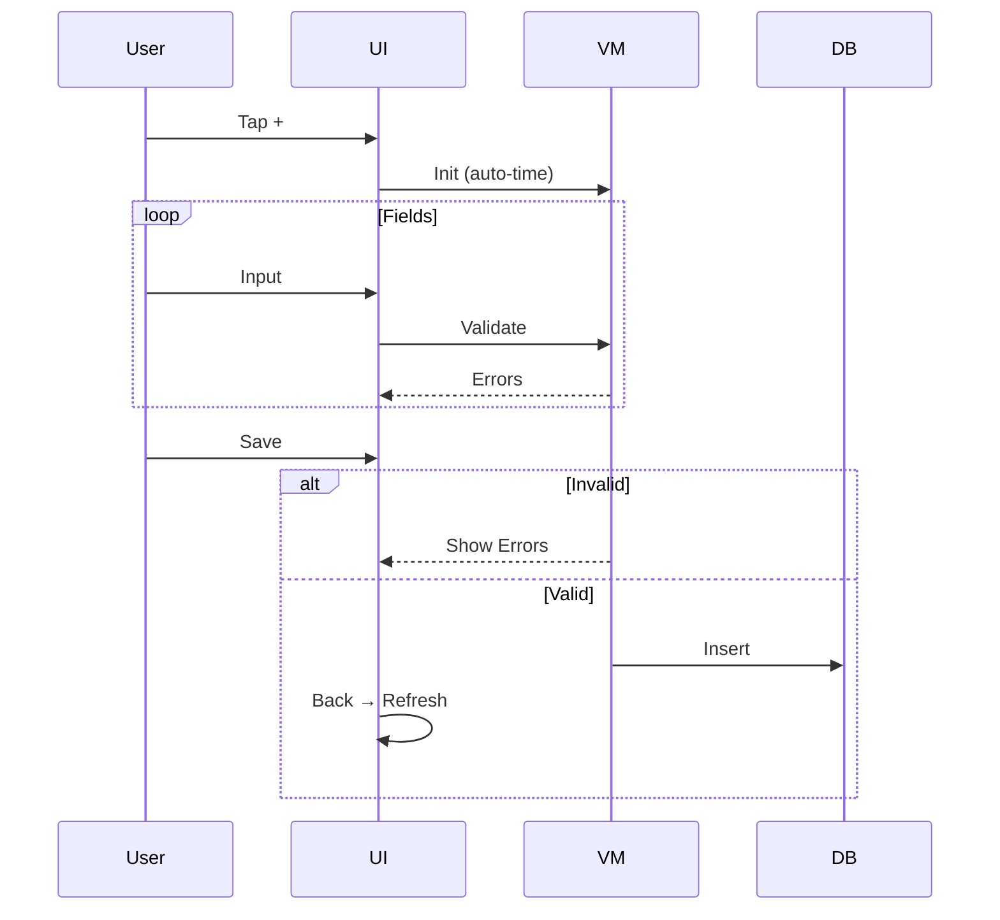
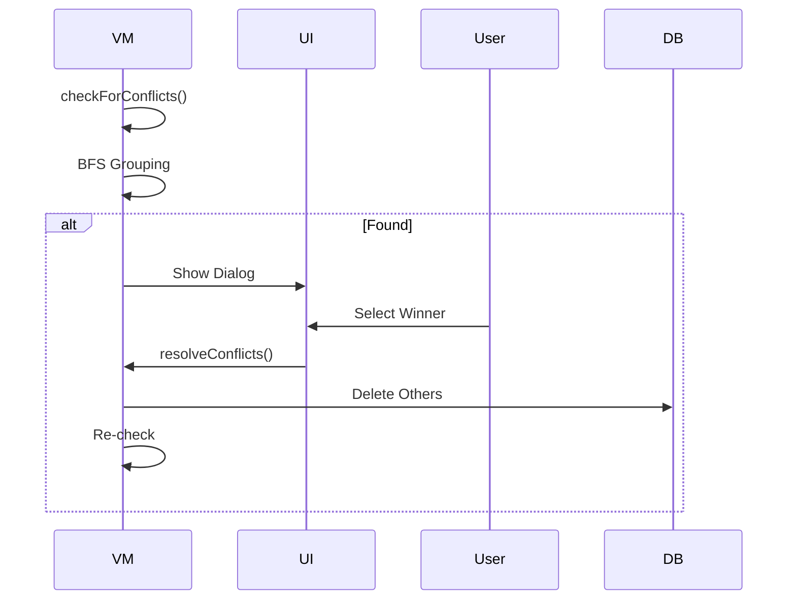
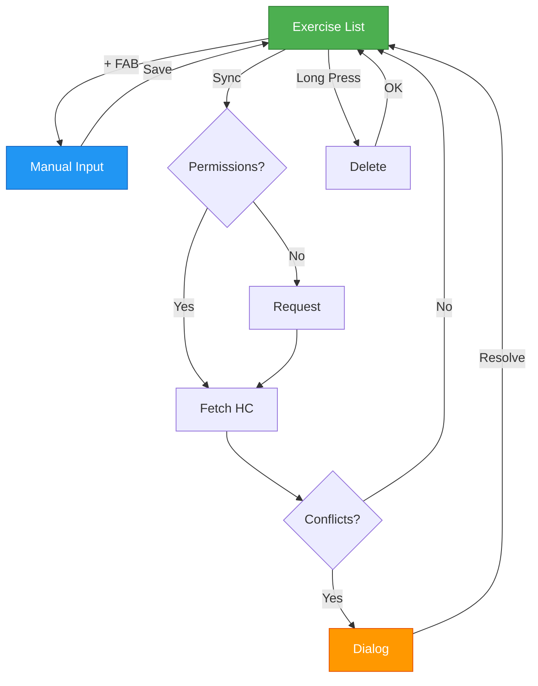

# 🏃 MyHealthApp - Feature Overview

> Android health tracker with intelligent conflict resolution

```
┌─────────────────────────────────────────────────────────────────┐
│  🔄 Health Connect Sync  │  ✍️  Manual Input  │  ⚠️  Conflicts │
└─────────────────────────────────────────────────────────────────┘
```

## 🔄 Health Connect Integration

<table>
<tr>
<td width="50%">

```
📅 Range:    Last 7 days
🔄 Deduplication:    ±5 min threshold
🏆 Priority: HC > Manual
🔐 Access:   Permission-based
```

**Retrieved Data:**
- Exercise type, time, duration
- Distance & calories (optional)

</td>
<td width="50%">



</td>
</tr>
</table>

**Pipeline:** `📡 Sync → 🔍 Dedup (±5min) → 💾 Save → ⚠️ Detect Conflicts`

---

## ✍️ Manual Input

<table>
<tr>
<td width="50%">

**Required:** 🏃 Type • ⏱️ Duration • 📅 Time
**Optional:** 📏 Distance • 🔥 Calories • 📝 Notes

| Field | Rule | Error |
|-------|------|-------|
| Type | Not blank | Required |
| Duration | Integer | Required |
| Time | Valid | Required |
| Distance | Numeric | Valid number |
| Calories | Integer | Valid number |

</td>
<td width="50%">

**States:** `⏳ Init (auto-time) → ✏️ Edit (validate) → ✅ Saved`

**Flow:**
```
Input → Validate All ──┬──▶ ❌ Show Errors
                       └──▶ ✅ Save → DB → Back
```

</td>
</tr>
</table>

---

## ⚠️ Conflict Handling

<table>
<tr>
<td width="50%">

**Types:**
```
Time Overlap:
A: ████████████     (14:00-15:00)
B:      ████████████ (14:30-15:30)
        ↑ OVERLAP ↑

Duplicates: Same type within 5min
```

**Detection:** `e1.start < e2.end AND e2.start < e1.end`

**Algorithm:** Group overlaps → Resolve iteratively

</td>
<td width="50%">



</td>
</tr>
</table>

**Dialog:** Radio selection → Keep chosen → Delete rest → Re-check conflicts

---

## 🔄 Sequence Diagrams

### Sync Flow


### Manual Input Flow


### Conflict Resolution


---

## 🧮 Technical Details

### ⏱️ Overlap Detection
```
Timeline:  14:00    14:30    15:00    15:30
A:         ████████████████          (60min)
B:                  ████████████████  (60min)
                    ↑─ OVERLAP ─↑

Algorithm: e1.start < e2.end AND e2.start < e1.end
```

```kotlin
fun hasTimeOverlap(e1: Exercise, e2: Exercise) =
    e1Start < e2End && e2Start < e1End
```

### 🔄 Duplicate Detection
```
A: Running @ 14:00 (Manual)
B: Running @ 14:03 (HC)  → Within 5min → DUPLICATE

Priority: 🏆 HC > 📝 Manual
```

```kotlin
fun isSameTime(e1, e2, threshold = 5) =
    sameDate && abs(e1.time - e2.time) <= threshold
```

### 🧩 Conflict Resolution
**Phases:** `Discovery (BFS) → Grouping → Resolution (iterative)`

```
Example: [A,B,C,D,E]
A↔B, A↔C, B↔C → Group1: {A,B,C}
D↔E           → Group2: {D,E}
Result: 2 groups → resolve 1 at a time
```

---

## 🌟 Highlights

✅ Auto-dedup • ✅ Conflict detection • ✅ User control • ✅ Real-time validation
✅ Local storage • ✅ Permission-based • ✅ BFS algorithms • ✅ Reactive UI

---

## 🏗️ Architecture

```
🎨 PRESENTATION  →  Compose UI + ViewModel + StateFlow
         ↕
🏢 DOMAIN        →  Exercise entity + Business logic
         ↕
💾 DATA          →  Repository + Room DB + Health Connect
```

| Pattern | Implementation |
|---------|----------------|
| **MVVM** | `ViewModel` + Compose |
| **Repository** | Data abstraction |
| **Clean Arch** | Layered independence |
| **Reactive** | `StateFlow` observers |

**Flow:** `User → UI → ViewModel → Repository → Database`

---

## 📱 Navigation



## 🎨 Components

| Component | Type | Location |
|-----------|------|----------|
| Exercise List | `LazyColumn` | `ExerciseListScreen:109` |
| Exercise Card | `Card` | `ExerciseListScreen:134` |
| Conflict Dialog | `AlertDialog` | `ExerciseListScreen:190` |
| Manual Input | `Form` | `ManualInputScreen` |